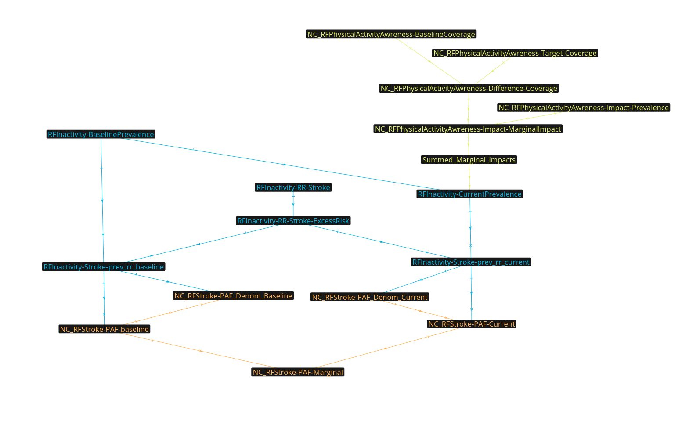

# NCD Risk Factor: Physical Inactivity

## Overview

This repository provides a translation of the risk factor `NC_RFInactivity` from Spectrum. It serves as a foundation for future modifications of the risk factor and its associated interventions as new model releases become available.

## Data Components

Risk Factors analysis requires three types of data:

1. Prevalence
2. Relative Risks
3. Intervention Impacts (Impact Factors)

### Data Sources

| Data Type | File Path | Worksheet Name |
|-----------|-----------|----------------|
| Prevalence | `./data/GBD_Country_Data.xlsx` | PIA_Guthold_2018 |
| Relative Risks | `./data/RiskFactorData.xls` | RR |
| Impact Factors | `./data/RiskFactorData.xls` | ImpactFactors |

### Accessing the Data

The Spectrum data is available in the `data/` directory of this repository.

For a computer-friendly version of this data:

1. Clone this repository
2. Run the `./extract_data.sh` script

**Prerequisites:**
- Bash shell
- Python (accessible via `python` command)

## Interventions

### P1: Primary Care Integration

**Intervention:** Provide physical activity assessment, counselling, and behaviour change support as part of routine primary health care services through the use of a brief intervention.

**Implementation:**
- Brief advice as part of routine care (95% coverage)

### P2: Population-wide Communication Campaigns

**Intervention:** Implement sustained, population-wide, best practice communication campaigns to promote physical activity, with links to community-based programmes and environmental improvements to enable and support behaviour change.

**Implementation:**
- Awareness campaigns to encourage increased physical activity (95% coverage)

## How the models work?

TLDR; The models work by modifying the incidence rate of a disease.
In the model image above, you can see a flow from yellow, to blue, to orange.
The final node in orange, `NC_RFStroke-PAF-Marginal` stores the calculated marginal population attributable fraction, which modifies incidence. Therefore, this node would be multiplied against a transition rate in another model (e.g. Stroke Incidence in CVD) to modify it.

Here are the steps:

### Step 1: Calculate the Baseline Population Attributable Fraction (PAF)
- the baseline coverage of the risk factor is loaded. We store this as `RFInactivity-BaselinePrevalence`
- The relative risk of the risk factor and the disease is loaded into `RFInatcitivty-RR-Stroke`
- The "excess risk" of this relative risk is calculated by subtracting 1 from the relative risk. This is stored in `RFInactivity-RR-Stroke-ExcessRisk`
- We multiply the prevalence by the excess risk, and store this in the node `RFInactivity-Stroke-prev_rr_baseline`
- We add this value to a node called `NC_RFStroke-PAF_Denom_Baseline`. This already has a value of 1, and the expectation is that all risk factors that impact stroke will have their "prev_rr" values added to this. Currently, as each model only has one risk factor, this is only done once.
    - "denom" here is referring to a "denominator". We are going to use this as a denominator in the next calculation.
- The baseline PAF (`NC_RFStroke-PAF-baseline`) is calculated as `RFInactivity-Stroke-prev_rr_baseline` / `NC_RFStroke-PAF_Denom_Baseline`

### Step 2: Calculate the Impact of the Intervention on Prevalence
- the effect of the intervention is loaded in and stored in `NC_RFPhysicalActivityAwreness-Impact-Prevalence`
- the baseline coverage is set in `NC_RFPhysicalActivityAwreness-BaselineCoverage` and the target coverage is set in `NC_RFPhysicalActivityAwreness-Target-Coverage`
    - We set the baseline coverage as a negative number, which will be relevant in the next step
- We calculate the difference in coverage by adding both coverages together (remember, baseline is a negative)
- The marginal impact is calculated by multiplying the difference in coverage by the effect size. This is stored as `NC_RFPhysicalActivityAwreness-Impact-MarginalImpact`
- This is added to a node called `Summed_Marginal_Impacts` which is kept in case several interventions are being considered.

### Step 3: Calculate the Target/Current Population Attributable Fraction
This follows the exact same steps as Step 1, except instead of just using `RFInactivity-BaselinePrevalence` we are using that value, then modifying it by multiplying it against the (1 - `Summed_Marginal_Impacts`).

### Calculate the Marginal Population Attributable Fraction
- We are left with `NC_RFStroke-PAF-baseline` and `NC_RFStroke-PAF-Current`.
- The marginal paf (`NC_RFStroke-PAF-Marginal`) is simply `Current` minus `baseline`.

## Contributing

[Notes on how to contribute]

## License

[Insert appropriate license information here]

## Contact

For questions or further information, please contact [insert contact information].
